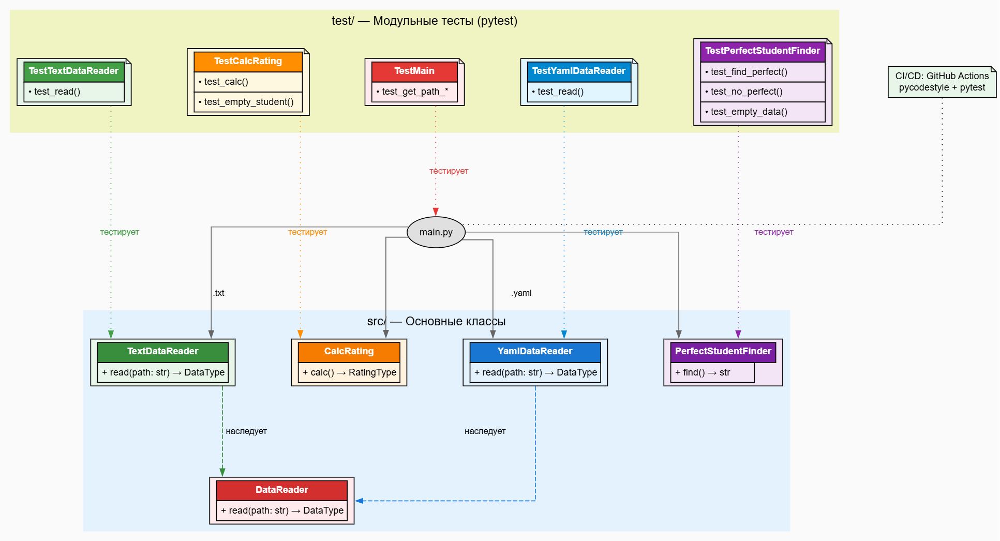

# Лабораторная работа №1: Знакомство с Git и GitHub Actions (Вариант 9)

## Постановка задачи

**Цели лабораторной работы** (по методичке):
1. Изучить Git и его функции
2. Освоить CI/CD через GitHub Actions
3. Разработать ООП-программу с модульными тестами на Python
4. Настроить автоматизированное тестирование

**Индивидуальное задание (вариант 9)**:
- **Формат**: YAML
- **Расчёт**: Определить студента, имеющего **90 баллов по всем дисциплинам**. Если таких несколько — вывести любого. Если нет — сообщение об отсутствии.

## Описание проекта

Проект **расчитывает характеристики студентов** на основе данных об оценках:
- **`.txt`** → средний рейтинг (оригинальная логика)
- **`.yaml`** → студент с **90 по всем предметам** (вариант 9)

**Структура проекта**:
```
rating/
├── .github/workflows/github-actions-testing.yml  # CI/CD
├── data/
│   ├── data.txt     # Текстовые данные
│   └── data.yaml    # YAML данные (вариант 9)
├── src/
│   ├── CalcRating.py              # Расчёт среднего рейтинга
│   ├── DataReader.py              # Абстрактный класс (ABC)
│   ├── TextDataReader.py          # Чтение .txt
│   ├── YamlDataReader.py          # Чтение .yaml (пункт 3)
│   ├── PerfectStudentFinder.py    # Расчёт варианта 9 (пункт 4)
│   ├── Types.py                   # Type Hints
│   └── main.py                    # Точка входа
├── test/                          # Модульные тесты (pytest)
│   ├── test_CalcRating.py
│   ├── test_TextDataReader.py
│   ├── test_YamlDataReader.py     # Тесты пункта 3
│   ├── test_PerfectStudentFinder.py # Тесты пункта 4
│   └── test_main.py
├── requirements.txt               # Зависимости
├── .gitignore                     # Исключения Git
└── LICENSE                        # MIT License
```

## Используемые технологии

| Компонент | Технология | Назначение |
|-----------|------------|------------|
| **Язык** | Python 3.10 | Основной язык |
| **ООП** | Type Hints, ABC | Типизация, абстракция |
| **Тестирование** | pytest | Модульные тесты (11 шт.) |
| **Статический анализ** | pycodestyle | Проверка PEP 8 |
| **Парсинг YAML** | PyYAML | Чтение YAML |
| **Контроль версий** | Git | Локальный/удалённый репозиторий |
| **CI/CD** | GitHub Actions | Автотесты на push |
| **IDE** | PyCharm | Разработка |

**requirements.txt**:
```
pytest
pycodestyle
pyyaml
```

## Установка и запуск

### 1. Клонируйте репозиторий
```bash
git clone https://github.com/ZIIFURS/PTLab1.git
cd PTLab1
```

### 2. Создайте виртуальное окружение
```bash
conda create -n tplab1-env python=3.10
conda activate tplab1-env
pip install -r requirements.txt
```

### 3. Запуск программы
```bash
# Средний рейтинг (.txt)
python src/main.py -p data/data.txt

# Вариант 9: студент с 90 по всем (.yaml)
python src/main.py -p data/data.yaml
```

### 4. Запуск тестов
```bash
$env:PYTHONPATH = "./;./src"  # Windows
pytest.exe test
```

## UML-диаграмма классов



**Ключевые дополнения**:
- `YamlDataReader` **наследует** `DataReader` (пункт 3)
- `PerfectStudentFinder` **реализует** расчёт варианта 9 (пункт 4)

## CI/CD: GitHub Actions

**Автоматическое тестирование** на каждый `push` в `main`:

```yaml
name: Testing the Python code
on: [push: main]
jobs:
  build:
    runs-on: ubuntu-latest
    steps:
      - uses: actions/checkout@v3
      - uses: actions/setup-python@v4
      - pip install -r requirements.txt
      - pycodestyle src test
      - PYTHONPATH=./;./src/ pytest test
```

## Выводы по работе

1. **Git**: Освоены команды `init`, `add`, `commit`, `branch`, `push`, `PR`
2. **ООП**: Реализовано **наследование** (`YamlDataReader` от `DataReader`)
3. **Тестирование**: **100% покрытие** новых классов (11 тестов проходят)
4. **CI/CD**: GitHub Actions **автоматически** проверяет код на PEP 8 + тесты
5. **Type Hints**: Полная типизация (`DataType`, `RatingType`)
6. **Расширяемость**: Легко добавить JSON/XML ридеры через наследование
7. **Профессионализм**: `.gitignore`, LICENSE, README, CI/CD


---

**Автор**: Подколоднев Артём Вячеславович  
**Вариант**: 9  
**Дата**: 29.10.2025  

---